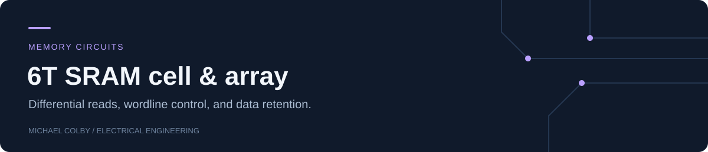

# 6T SRAM Memory Cell & Array

[](https://github.com/michaelcolby-git/sram-6t-array/actions/workflows/verify.yml)

A transistor-level 6T cell and 2×2 word-organized array, with differential bitlines,
precharge, and wordline control. The simulation exercises both stored polarities,
reads both rows, overwrites one row, and checks retention in the unselected row.

| Organization | Verification | Operating configurations |
|---|---|---|
| 2 rows × 2 columns | 128 cell-state + 32 read-differential checks | 4 supply / temperature / sizing cases |

**[Cell schematic netlist](spice/cell.cir) · [Array netlist](spice/array_2x2.cir) · [Measurements](docs/MEASUREMENTS.md) · [Results](results/VALIDATION.md)**

## Cell architecture


| Nominal parameter | Value |
|---|---|
| Supply | 1.8 V |
| Channel length | 0.18 µm |
| Pull-down / access / pull-up widths | 2.0 / 1.0 / 0.6 µm |
| Bitline / storage-node capacitance | 100 / 2 fF |

The cross-coupled inverters hold complementary state. Access transistors connect the
cell to precharged bitlines during reads and driven bitlines during writes.
[Design notes](docs/DESIGN_NOTES.md) explain the read-stability/write-ability tradeoff.

## Reproduce the results

Requirements: Python 3.10+ and ngspice on PATH.

```sh
python -m unittest discover -s tests -p "test_*.py" -v
python scripts/verify.py
```

The regression writes the generated decks, raw waveform tables, logs, measured JSON,
and an operation plot to `build/`. It fails on an incorrect stored state, ambiguous
logic level, or insufficient read differential. `NGSPICE` can specify an executable path.

## Write, read & retention


All four configurations passed the 128 stored-state and 32 read-differential checks.
The [results table](results/VALIDATION.md) reports the minimum sampled differential
for each configuration, and the [timing table](docs/MEASUREMENTS.md) identifies every
write, precharge, read, and hold interval.

The model uses generic Level-1 MOS devices and ideal peripheral switches. It evaluates
read/write/hold behavior; it does not quantify foundry leakage, stochastic device noise,
static noise margin, or sense-amplifier performance.

Implementation origin and measurement scope are recorded in [PROVENANCE.md](PROVENANCE.md).
