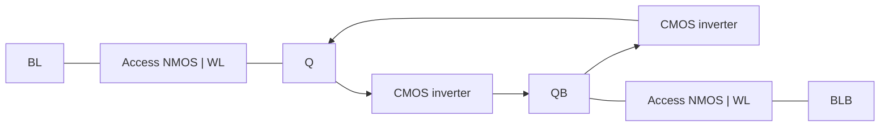

# 6T SRAM cell and 2x2 array

Transistor-level storage with differential bitlines and wordline-controlled access.
The test writes both data polarities, reads both rows, overwrites one row, and checks
that the other row retains its contents.

This is a newly implemented reference design; see [provenance](PROVENANCE.md).
It uses illustrative Level-1 models, not recovered Cadence schematics or a foundry PDK.

## Run

```sh
python scripts/verify.py
```

Requires Python 3.10+ and ngspice. No Python packages are needed. Runs nominal and
selected voltage/temperature/device-ratio configurations and fails on corrupted cell
state, invalid logic levels, inadequate bitline differential, or simulator errors.
Raw waveforms, logs, actual measured values, and an SVG plot are written to `build/`.

## Circuit



Each cell has two CMOS inverters and two access NMOS devices. Nominal widths are
pull-down 2.0 um, access 1.0 um, pull-up 0.6 um; channel length is 0.18 um.
Nominal supply is 1.8 V. These are explicit design assumptions, not historical measurements.

- [Six-transistor cell](spice/cell.cir)
- [Generated 2x2 array](spice/array_2x2.cir)
- [Stimulus and checks](scripts/verify.py)
- [Measurement scope and next experiments](docs/MEASUREMENTS.md)

Peripheral write drivers and precharge controls are ideal switches. There is no
transistor sense amplifier or address decoder. The chosen 100 fF bitline and 2 fF
storage-node loads are illustrative. Level-1 devices do not support credible modern
subthreshold leakage or variability predictions. Read success is not an SNM measurement.

## Measured validation

**128 cell-state checks and 32 read-differential checks passed** across four
configurations. See the [measured table and logs](results/VALIDATION.md).


