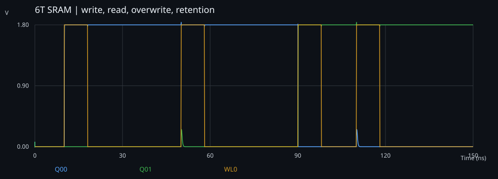

# Local validation

Executed with Python 3.12.14 on Windows, Icarus Verilog 10.1 (HDL), and ngspice 47 (analog), as applicable.

Four configurations passed **128 cell-state checks** and **32 read-differential checks**. Four Python measurement tests passed.

| Supply (V) | Temperature (C) | Pull-down width (um) | Minimum sampled read differential (V) |
|---|---|---|---|
| 1.8 | 25 | 2.0 | 1.803540 |
| 1.62 | 85 | 2.0 | 1.621782 |
| 1.98 | -20 | 2.0 | 1.983944 |
| 1.8 | 25 | 2.4 | 1.803563 |

These numbers apply to the included reference implementation and test conditions.
Local checks are not formal verification, timing closure, silicon measurements, or
a reproduction of original resume measurements. GitHub Actions independently reruns the regression; the live workflow badge links
to its current status.
